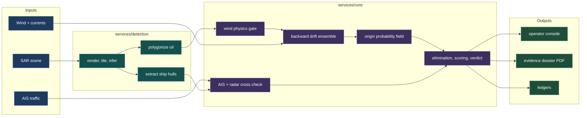
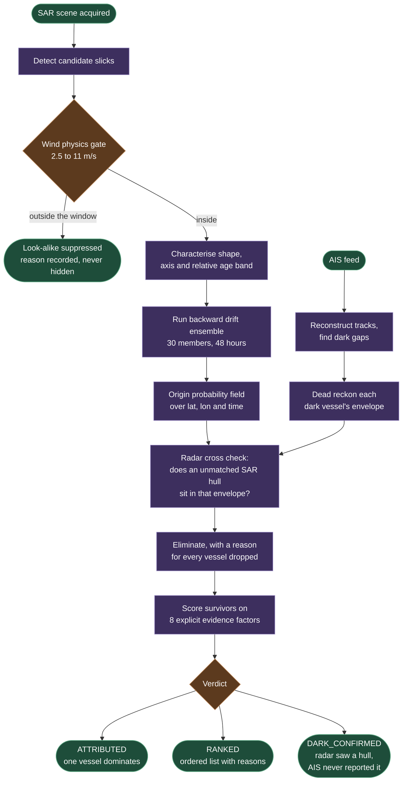

<div align="center">

# DRISHTA

**A maritime event attribution engine.**

Detect an oil slick on satellite radar, reconstruct where and when it was released, and rank which vessel's behaviour best explains it, including vessels that were not broadcasting.

[](docs/SETUP.md)
[](docs/SETUP.md)
[](docs/SETUP.md#setup-per-platform)
[](docs/VALIDATION.md)
[](docs/DATA.md)

Built for Smart India Hackathon 2026, NTRO Problem Statement 26143.

[Quick start](#quick-start) · [Architecture](#architecture) · [Documentation](#documentation) · [Status](docs/STATUS.md)

</div>

---

## The problem

An oil slick on satellite imagery is a crime scene with no timestamp and no suspect, and it is not where it started.

By the time a Sentinel-1 pass sees a slick, wind and current have moved it for hours. The vessel responsible is long gone, and the one most likely to be responsible is the one that stopped broadcasting its position while doing it. Existing systems answer "is there oil here". DRISHTA answers **"who put it there"**.

The system does not report where a spill started. It reports the probability of every place and time it could have started, then asks which vessel's behaviour is best explained by that distribution.

Underneath that sits an architectural claim: **the drift kernel is a plug in**. An oil spill is instance one of a general problem shape, which is "given an observed effect at a known place and time, reconstruct the origin window and rank who was present in it, including actors that were not broadcasting." A null kernel runs the entire pipeline with no forcing data at all, which is what proves the engine is event agnostic rather than an oil spill script.

## Quick start

**No dataset download is required.** Nothing here is blocked on a Copernicus account, an Earthdata login, a real AIS feed or a 40GB Zenodo archive. One SAR scene is committed to the repository as the staged sample image, and every other input the pipeline consumes is generated locally and deterministically by a single script.

```bash
git clone https://github.com/RiteshGadarla/Slicktrace.git && cd Slicktrace
make setup     # venv, model weights, synthetic data, demo bundle, frontend deps
make sample    # process the staged sample SAR image, print the oil detections
make dev       # core service on :8000, landing page on :5173, operator console on :5173/run
```

```
2 oil detection(s):
  detection_id               mean prob   pixels  area km2  centroid (lon, lat)
  DRISHTA-SAMPLE-0001-oil-000     0.636      125     0.012  (67.9972, 17.0543)
  DRISHTA-SAMPLE-0001-oil-001     0.881     1493     0.151  (67.9965, 17.0476)
```

The only network fetch beyond pip and npm is the segmentation model's weights (about 205MB, from HuggingFace, no account and no API token). They are cached to disk, so every run after the first is fully offline.

Runs natively on **Linux, macOS and Windows**. Windows has no `make`, so `python scripts/dev.py` replaces `make dev` there and the rest run as direct commands. Full per-platform instructions, troubleshooting and every command: **[docs/SETUP.md](docs/SETUP.md)**.

## Architecture



## How it works



`DARK_CONFIRMED` is not a failure state. Every competing system files "no broadcasting suspect found" as no result. For an intelligence organisation, it is the finding.

Stage by stage, with the file that implements each one: **[docs/ARCHITECTURE.md](docs/ARCHITECTURE.md)**.

## What makes it defensible

| | |
|---|---|
| **A field, never a point** | The hindcast output is a probability distribution over latitude, longitude and time. A centroid may be drawn for orientation but never enters the scoring math |
| **Eight explicit factors** | No classifier is trained for attribution. Every weight lives in `backend/config/scoring.yaml`, is shown in the UI, and is printed verbatim in the dossier. See [docs/EVIDENCE_MODEL.md](docs/EVIDENCE_MODEL.md) |
| **Two independent sensors** | A dark vessel is confirmed against an unmatched ship hull in the same SAR scene, so darkness becomes an observation rather than an inference about missing data |
| **Every elimination has a reason** | Non empty, logged, and shown on screen. Vessel type never eliminates, it only downweights. Dark periods never eliminate either |
| **Hash sealed output** | The dossier carries the SHA-256 of every input artifact and a Bharatiya Sakshya Adhiniyam s.63 Part A certificate. Part B is left for a human to sign, because the statute requires that |
| **Reproducible** | Every stochastic component seeds from configuration. Two runs produce identical numbers |

## Documentation

| Document | What is in it |
|---|---|
| **[SETUP.md](docs/SETUP.md)** | Prerequisites, per-platform setup for Linux, macOS and Windows, synthetic data generation, every command, troubleshooting |
| **[ARCHITECTURE.md](docs/ARCHITECTURE.md)** | The pipeline stage by stage, the pluggable drift kernel, service boundaries, the operator console |
| **[EVIDENCE_MODEL.md](docs/EVIDENCE_MODEL.md)** | The eight factors, the three verdict classes, the radar cross check and its limits, MARPOL, the s.63 certificate |
| **[DATA.md](docs/DATA.md)** | What is real, what is synthetic, why, and how to swap in real data |
| **[VALIDATION.md](docs/VALIDATION.md)** | Three independent validation tracks and what each one can and cannot claim |
| **[STATUS.md](docs/STATUS.md)** | Phase by phase build status and what the open items are blocked on |
| **[PLAN.md](PLAN.md)** | The full build plan, data contracts, non-negotiables and phase order. **The source of truth for design decisions** |

## Repository layout

```
PLAN.md          the source of truth for design decisions
docs/            architecture, setup, evidence model, data, validation, status
deck/            P-1 deck figures and the scripts that build them
backend/
  config/        scoring.yaml, pipeline.yaml, demo.yaml, marpol.yaml
  services/      core/ and detection/, one shared venv
  validation/    a sibling of services/, never imported by it
  tests/
  scripts/
    make_synthetic_data.py   one command, every synthetic input
    process_sample.py        one command, process the staged sample image
    seed_demo.py             the full pipeline, into the precomputed bundle
    run_validation.py        50 incidents and three ablations
  data/fixtures/
    synthetic_scene.tif      the staged sample image, committed
    real_oil_texture/        the real CC BY 4.0 slick patch composited into it
frontend/        the operator console
scripts/dev.py   cross-platform launcher for both servers
```

`backend/validation/` being a sibling of `backend/services/` rather than a child is deliberate: it is what keeps measurement tools out of the runtime path, and a test enforces it by scanning the source tree.

## Status

A working end to end system with named gaps rather than hidden ones. Detection, wind gating, drift, AIS reconstruction, the radar cross check, scoring, verdicts, MARPOL and the dossier are built and tested. Per class detection accuracy, Cerulean agreement and drifter validation are written but blocked on data access, and the code raises rather than substituting a number.

Full breakdown: **[docs/STATUS.md](docs/STATUS.md)**.

## Statements this system makes about itself

These are load bearing. They are in the code, the dossier and the UI, not just here.

- Absolute slick age in hours cannot be estimated reliably from a single SAR acquisition. We tested whether it is recoverable, concluded it is not, and therefore report a relative band with the reasoning that produced it, never a number in hours.
- The hindcast output is a probability field, never a point. A centroid may be displayed for orientation but never enters the scoring math.
- Every eliminated vessel carries a non empty reason. Vessel type and class never eliminate a vessel, they only downweight its score.
- Dark periods raise suspicion. They never drop a vessel.
- The output is ranked evidence for a human investigator. It is not an automated accusation.
- Every stochastic component takes its seed from configuration. Two runs of the demo produce identical numbers.
