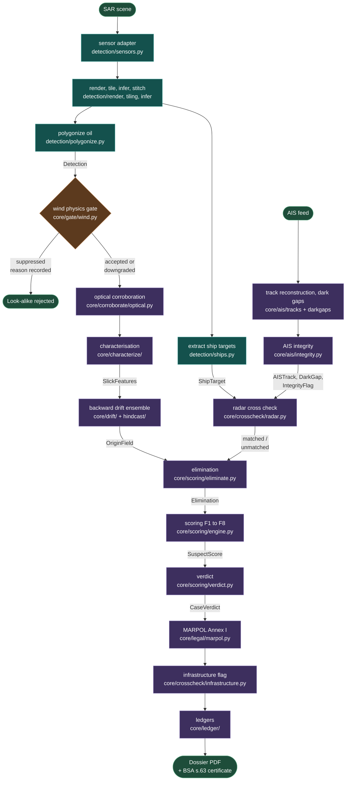

# Architecture

How Pharos is put together, stage by stage, and why the boundaries sit where they do.

[← Back to the README](../README.md)

---

## The architectural claim

**The drift kernel is a plug in.** An oil spill is instance one of a general problem shape: given an observed effect at a known place and time, reconstruct the origin window and rank who was present in it, including actors that were not broadcasting.

Everything downstream of the kernel (field binning, AIS reconstruction, cross check, elimination, scoring, verdict, dossier) is written against the `OriginField` contract, not against oil. Three kernels ship:

| Kernel | Physics | What it proves |
|---|---|---|
| `openoil` | OpenDrift OpenOil, the default | The real case: a slick that weathers and spreads |
| `leeway` | OpenDrift OceanDrift | Drifting objects and debris, a different event class through the same engine |
| `null` | Seed geometry held fixed, no forcing at all | That the engine is event agnostic. It runs the **whole pipeline end to end with no forcing data**, which is the strongest available evidence that nothing downstream secretly depends on oil physics |

Swapping `hindcast.kernel` in `backend/config/pipeline.yaml` is a one line diff. Every downstream stage runs unchanged against all three, and `backend/tests/test_drift_null_kernel_end_to_end.py` holds that line.

## System architecture

```mermaid
flowchart TB
    subgraph sources["Inputs"]
        direction LR
        SAR["SAR scene<br/>GeoTIFF, sigma0"]
        FORCE["Wind + currents<br/>CF NetCDF"]
        AISIN["AIS traffic<br/>MarineCadastre schema"]
        STATIC["Coastline, MARPOL areas,<br/>installations GeoJSON"]
    end

    subgraph det["services/detection :8001"]
        direction LR
        ADAPT["sensors.py<br/>S1 / EOS-04 stub"] --> RTI["render, tile, infer, stitch"]
        RTI --> POLY["polygonize.py"]
        RTI --> SHIPS["ships.py"]
    end

    subgraph core["services/core :8000"]
        direction TB
        GATE["Wind physics gate"] --> CHAR["Characterisation"]
        CHAR --> DRIFT["Drift kernel<br/>openoil / leeway / null"]
        DRIFT --> FIELD["Origin probability field"]
        FIELD --> SCORE["Elimination, scoring,<br/>verdict, MARPOL"]
        AISREC["AIS reconstruction,<br/>dark gaps, integrity"] --> SCORE
        XCHK["Radar cross check"] --> SCORE
    end

    subgraph out["Outputs"]
        direction LR
        CONSOLE["Operator console<br/>MapLibre + deck.gl"]
        PDF["Evidence dossier<br/>PDF + BSA s.63"]
        LEDGER["Ledgers<br/>dark periods, completeness"]
    end

    VAL["backend/validation/<br/>never imported by services/"]

    SAR --> ADAPT
    FORCE --> DRIFT
    AISIN --> AISREC
    STATIC --> SCORE
    POLY --> GATE
    SHIPS --> XCHK
    SCORE --> CONSOLE
    SCORE --> PDF
    SCORE --> LEDGER
    POLY -. "measured against" .-> VAL
    DRIFT -. "measured against" .-> VAL

    classDef src fill:#1f3a5f,stroke:#5b8db8,color:#fff
    classDef d fill:#14514d,stroke:#4fa8a0,color:#fff
    classDef c fill:#3d2f5e,stroke:#8b7bb8,color:#fff
    classDef o fill:#1e4d3a,stroke:#5faa85,color:#fff
    classDef v fill:#4a3c1d,stroke:#a8913f,color:#fff
    class SAR,FORCE,AISIN,STATIC src
    class ADAPT,RTI,POLY,SHIPS d
    class GATE,CHAR,DRIFT,FIELD,SCORE,AISREC,XCHK c
    class CONSOLE,PDF,LEDGER o
    class VAL v
```



`backend/validation/` is a **sibling** of `backend/services/`, not a child. That is what keeps measurement tools, Cerulean above all, out of the runtime path, and `backend/tests/test_no_cerulean_in_services.py` enforces it by scanning the source tree.

## Pipeline flow

The order stages actually run in, with the contract each one emits. Every arrow is a typed record from `backend/services/core/schemas.py`.



### The same thing as a table

```
SAR scene
  -> sensor adapter          services/detection/sensors.py       (S1 implemented, EOS-04 a documented stub)
  -> render, tile, infer     services/detection/render|tiling|infer.py
  -> polygonize (oil)        services/detection/polygonize.py    -> Detection
  -> ship targets (hulls)    services/detection/ships.py         -> ShipTarget
  -> wind physics gate       services/core/gate/wind.py          -> GateResult
  -> optical corroboration   services/core/corroborate/optical.py -> OpticalCorroboration
  -> characterisation        services/core/characterize/         -> SlickFeatures
  -> backward drift ensemble services/core/drift/ + hindcast/    -> OriginField
  -> AIS reconstruction      services/core/ais/tracks|darkgaps.py -> AISTrack, DarkGap
  -> AIS integrity           services/core/ais/integrity.py      -> IntegrityFlag
  -> radar cross check       services/core/crosscheck/radar.py   -> matched / unmatched targets
  -> elimination             services/core/scoring/eliminate.py  -> Elimination
  -> scoring, F1 to F8       services/core/scoring/engine.py     -> SuspectScore
  -> verdict                 services/core/scoring/verdict.py    -> CaseVerdict
  -> MARPOL Annex I          services/core/legal/marpol.py       -> MarpolAssessment
  -> infrastructure flag     services/core/crosscheck/infrastructure.py
  -> ledgers                 services/core/ledger/               -> accumulating records
  -> dossier + certificate   services/core/dossier/              -> PDF
```


## Why the wind gate is a gate and not a factor

A slick look-alike is most often a low wind glassy patch, which damps backscatter the same way oil does. Below roughly 2.5 m/s the sea is too flat for the contrast to mean anything, and above roughly 11 m/s wind mixing breaks a real slick up. The gate encodes that as a hard decision with a recorded reason rather than as a soft score, because a suppressed detection must be explainable as "the physics says this cannot be read", not as "it scored low".

Suppressed detections are kept and displayed greyed with their reason, never silently dropped.

## The operator console

`frontend/` is an operator console: MapLibre plus deck.gl, chart paper styling, no external tiles, works offline. What is built:

- A single time scrubber that drives the origin probability field and every AIS track together. It opens at the acquisition time and plays backwards from it, and reads its position relative to acquisition rather than as a bare UTC stamp.
- The SAR scene as a basemap, so detection polygons sit on the image they came from. It is a display product on a sea anchored dB stretch, not the calibrated data the model saw, and the stretch it used is on screen in the provenance chip.
- Detection polygons with their wind gate verdicts, suppressed detections greyed with the reason on hover.
- AIS tracks with dark gaps drawn dashed and their dead reckoned envelopes as translucent polygons.
- **Radar ship targets**: unmatched targets filled in `--radar`, matched targets hollow in the same colour. Both are drawn, because a cross check that matches nothing is a broken matcher rather than a fleet of dark vessels, and you cannot see the difference unless both are on screen.
- A verdict chip and card, a suspects panel with animated factor bars and narratives, a plain elimination log, and a plain ledger view.
- Three view presets (Scene, Origin, Traffic), because the case spans two orders of magnitude and no single camera shows it all.

Known gap against PLAN.md section 16: suspect ranking is the static already scored result rather than recomputed per scrub tick, so the P9 acceptance test is only partly met. Sections 16A layers 1 to 3 (ambient flow shader, rewind sequence, space time prism) are not started.

The origin field's colour ramp is normalised per timestep rather than across the whole volume, because the same probability mass covers steadily more ground as the hindcast runs back and its peak density falls by over an order of magnitude. Normalised globally the early field renders as almost nothing, which reads as "there is nothing here" rather than "little is known here". Per timestep normalisation keeps the shape readable but hides that density drop, so the spread is stated as a number in kilometres beside the scrubber instead of being left to be inferred from how faint a blob looks on a projector.


## Service boundaries

| | Port | Runs where | Needs |
|---|---|---|---|
| `services/detection` | 8001 | Local Python | The model weights on disk |
| `services/core` | 8000 | Local Python | The fixtures or a real dataset |
| `frontend` | 5173 dev | Node + Vite | Nothing, if `frontend/public/data/` is seeded |
| Postgres / PostGIS / Timescale | 5432 | Docker | Only the ledger view reads it |

Only the database runs in Docker. `services/core`, `services/detection` and `validation` share one Python environment. See [SETUP.md](SETUP.md).

The console falls back to a static precomputed bundle when the core service is not running, which is what makes the offline demo path work with no backend process at all. The one thing that fallback cannot serve is the ledger view, and that is stated on screen rather than failing silently.
