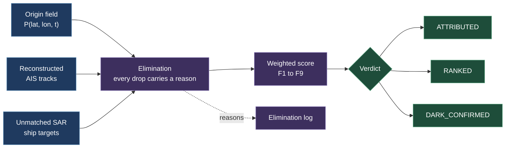

# The evidence model

How Pharos turns an origin probability field and a set of reconstructed vessel tracks into a ranked, explainable evidence package.

[← Back to the README](../README.md)

---

No classifier is trained for attribution. There is no ground truth to train one on, and a black box cannot be defended in court. Every factor below is an explicit weighted term whose weight lives in `backend/config/scoring.yaml`, is shown in the UI, and is printed in full in the dossier.

## The nine evidence factors

Weights and thresholds live in `backend/config/scoring.yaml`, are shown in the UI, and are printed in full in the dossier. The weight in brackets is the one the config ships with.

| | Factor | What it measures |
|---|---|---|
| F1 | field integral (3.0) | Origin probability integrated along the vessel's reconstructed track. Rewards a vessel that lingered inside a broad uncertain cloud over one that clipped a narrow peak, which distance to centroid ranking gets exactly backwards |
| F2 | dark overlap (2.5) | How much origin probability mass the vessel's dead reckoned envelope covered while it was dark |
| F3 | axis alignment (1.5) | Agreement, modulo 180 degrees, between the slick's major axis and the vessel's course |
| F4 | speed anomaly (1.0) | Sustained slowing below the vessel's own median transit speed while inside the field |
| F5 | course anomaly (0.75) | Course change across the vessel's passage through the origin window |
| F6 | vessel plausibility (0.25) | A small prior by vessel type. **Downweights only. It never eliminates**, and its weight is kept low deliberately |
| F7 | AIS integrity (1.25) | Aggregated severity of self report inconsistencies: missing IMO, implied speed beyond the plausible maximum, static data changing mid passage, MMSI reuse, position jumps. This answers "AIS can be spoofed, not just switched off" with a factor rather than a shrug |
| F8 | radar confirmed dark (3.0) | An unmatched ship target from the SAR scene itself fell inside the vessel's dark envelope and in a live cell of the origin field. **The only factor backed by a second, independent sensor**, which is why it is weighted level with F1, the joint highest in the model |
| F9 | temporal consistency (0.75) | How close the vessel's best opportunity to be the source sits to the origin window the slick's own condition implies. F1 already weights the field's time axis, but it does so inside an integral over space, where a lot of mass at the wrong hour looks the same as a little mass at the right one. F9 asks the timing question on its own, with space marginalised out, so it can be shown as its own step in the case build and argued with. Capped at 0.75 for the reason F6 is capped: it is derived from heuristic radiometry, so it must shade a ranking and never decide one |

## The three verdict classes

| Verdict | Condition | Meaning |
|---|---|---|
| `ATTRIBUTED` | Rank 1 beats rank 2 by the configured dominance margin, and was broadcasting throughout the origin window | One vessel dominates. A ranked evidence package for a human investigator |
| `RANKED` | Several plausible candidates, none dominant | An ordered list with reasons, plus the full elimination log. Narrows the field |
| `DARK_CONFIRMED` | Every broadcasting vessel eliminated or below the plausibility floor, **and** at least one unmatched ship target sits inside the origin field | A vessel absent from the AIS picture was present in the origin envelope. Radar saw a hull; AIS did not report it |

`DARK_CONFIRMED` is not a failure state. Every competing system files "no broadcasting suspect found" as no result. For an intelligence organisation, it is the finding.

## The radar cross check, and its limits

The cross check is the highest value addition in this revision, because it converts a dark vessel from an inference about missing data into an independent sensor observation. Its limits travel with it, in the docs, in the dossier and in the code:

- Sentinel-1 ship detection at GRD resolution misses small vessels.
- Not every unmatched target is evasion. Vessels below AIS carriage requirements, fishing craft and buoys all appear. The system reports the count, the size and the position of unmatched targets, and never asserts that unmatched equals guilty.
- The match is made at the acquisition instant only. That cuts both ways, and the code takes it seriously: an unmatched target is only attributed to a vessel that was dark at that same instant, never to one whose gap had already closed. Without that rule the check degenerates, because a dead reckoned envelope widens at the vessel's plausible maximum speed and after an hour it is larger than the whole origin field.

## What the MARPOL layer does and does not say

`services/core/legal/marpol.py` evaluates the Annex I conditions that are checkable from a reconstructed track: proceeding en route, distance from nearest land, whether the track entered a special area, and an estimated instantaneous discharge rate. The rate is always a band, never a single figure, and the schema enforces that: SAR sees that a damping film is present, never how thick it is.

This layer never outputs a determination of illegality. It reports which conditions the reconstructed behaviour appears not to satisfy, with its assumptions printed in full in the dossier. Oil content in parts per million is not observable from satellite, so no assessment can ever conclude that a discharge was permitted on that basis, and the code does not attempt it.

## What the certificate claims

The dossier's final page is a Bharatiya Sakshya Adhiniyam, 2023 Section 63 Schedule Part A certificate, pre filled from information the pipeline already carries, including the SHA-256 of every input artifact with the hash function named. Part B is left blank, because the statute requires it to be completed and signed by a person, and that is a human act rather than a software output.

The claim is that the document is formatted to carry the information the certificate requires. The claim is **not** that the document is admissible. Admissibility is decided by a court on the facts.

## Ordering guarantees

These hold regardless of configuration, and tests enforce them:

- **Vessel type never eliminates.** F6 downweights only, and its weight is kept deliberately low. A tanker is not guilty of being a tanker.
- **Darkness never eliminates either.** A dark period raises suspicion and can never drop a vessel from consideration.
- **Every elimination carries a non empty reason.** The reason is written to the elimination log and shown in the console.
- **The forecast is never a scoring input.** Enforced in code, see `services/core/forecast/forward.py:assert_not_scoring_input`.
- **The field is never collapsed to a point for scoring.** A centroid may be displayed for orientation but never enters the math. F1 integrates over the field precisely so that a vessel lingering in a broad uncertain cloud outranks one clipping a narrow peak.
- **Timing can never outvote the origin field.** F9 runs through a logit, so it swings both ways and its full range is its weight times 5.89. At a weight of 1.0 that came to more than F1 and F2 can muster between them, which would have let a heuristic age band overturn the field itself. The weight is 0.75 and `backend/tests/test_temporal_consistency.py` holds the bound.

## Where the weights live

`backend/config/scoring.yaml`. Changing a weight changes the UI and the dossier together, because both read the same file rather than carrying their own copy. That is the point: a reviewer who disagrees with a weight can see it, change it, and re-run.

See [VALIDATION.md](VALIDATION.md) for the ablations that test whether each of these factors is load bearing or decorative.
