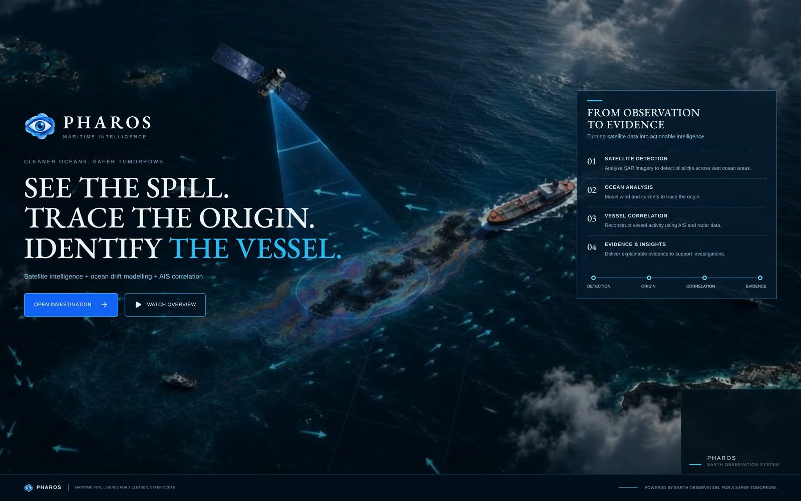
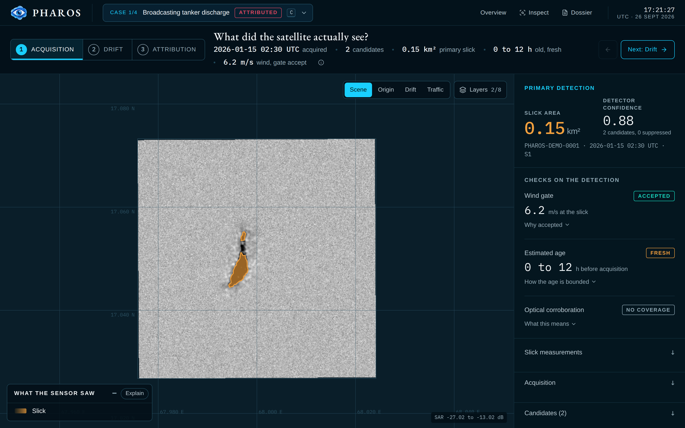
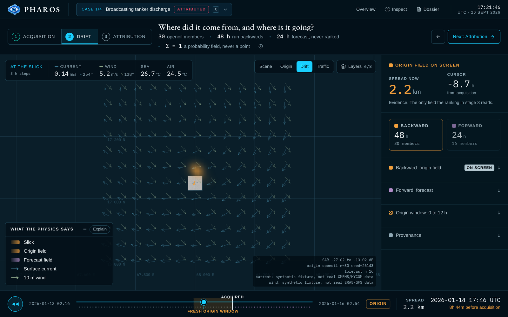
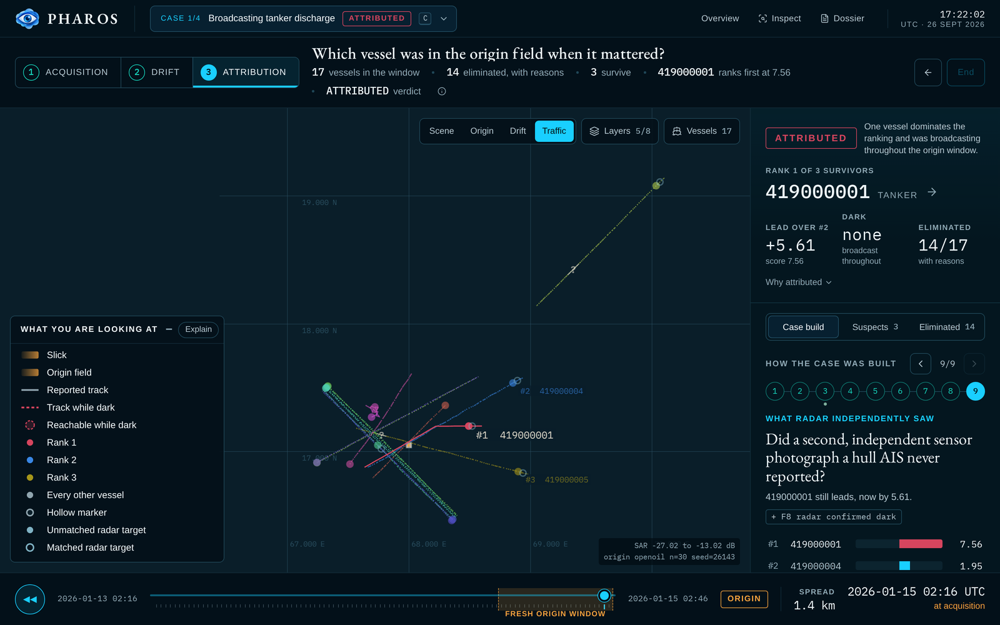
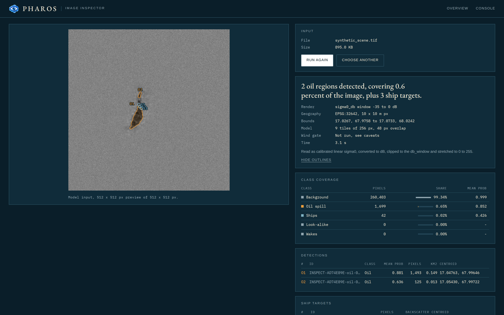

# Screenshots

What the three pages actually look like, captured from a local run against the default case study.

[← Back to the README](../README.md)

---

Every figure here is a real screen from `make dev`, not a mockup. The case is `PHAROS-DEMO-0001`, "Broadcasting tanker discharge", built by `make seed-demo` from the synthetic inputs described in [DATA.md](DATA.md). The numbers on screen are the ones the pipeline produced on that run.

The captures are reproducible: start the app, then drive it with the script in [Regenerating these](#regenerating-these).

## Landing page, `/`



The public face of the project. The three-line claim is the pipeline in order: see the spill on radar, trace it back to where it came from, name the vessel that was there.

## Operator console, `/run`

The console walks one case through three stages. The stage rail across the top is the argument: each stage asks a question, and the map and the right-hand panel answer it.

### Stage 1, acquisition



*What did the satellite actually see?* The SAR scene with the detected slick outlined, 0.15 km² at 0.88 detector confidence. The checks beside it are the ones that stop a look-alike becoming a case: the wind gate accepted at 6.2 m/s, the age band bounded to 0 to 12 hours, and optical corroboration honestly reported as no coverage.

### Stage 2, drift



*Where did it come from, and where is it going?* The time cursor is parked 8.7 hours before acquisition, inside the origin window the slick's own age implies. The glow is the origin probability field at that instant, a distribution over place and time that sums to one, never a point. Arrows are the surface current and 10 m wind driving the 30 member OpenOil ensemble backwards.

The provenance panel in the corner names the forcing as synthetic fixture data rather than real CMEMS, HYCOM, ERA5 or GFS. Nothing on screen is decorative: every animated layer is pipeline output.

### Stage 3, attribution



*Which vessel was in the origin field when it mattered?* 17 vessels entered the window, 14 were eliminated with a stated reason each, 3 survived. MMSI 419000001 ranks first at 7.56, a lead of 5.61 over rank 2, and the verdict is ATTRIBUTED because that vessel was broadcasting throughout the origin window.

"How the case was built" steps through the nine factors one at a time and shows the ranking moving as each is applied, so the score is a readable argument rather than a number out of a model.

## Image inspector, `/inspect`



Detection on its own, for any image you drop on it. Here it is running the staged sample scene, the same one `make sample` uses, so the output matches the README: two oil regions at 0.149 and 0.013 km², mean probabilities 0.881 and 0.636. Because the input is a GeoTIFF, the inspector resolves real coordinates and areas; an ordinary PNG gets pixel space only.

The panel states what it did to the input before the model saw it, which tiling it used, and that the wind gate was not run. A detection without that context is not evidence.

## Regenerating these

Start the app, then drive it with Playwright, which is already a frontend dependency:

```bash
make dev                                    # core on :8000, frontend on :5173
cp docs/screenshots/capture.mjs frontend/   # module resolution needs it beside node_modules
cd frontend && node capture.mjs && rm capture.mjs
```

Set `BASE` if the dev server picked a different port, for example `BASE=http://localhost:5174`. The script writes into `docs/screenshots/`, halves the captures back from 2x, and stores the hero as JPEG because it is a video frame.
